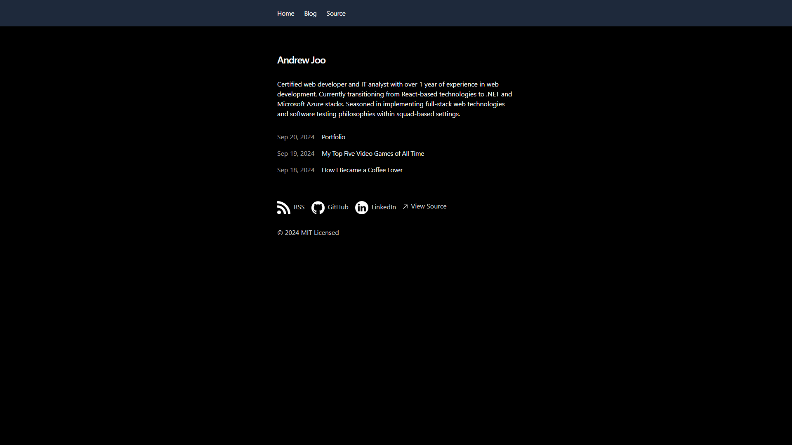

# Portfolio - Cloud Resume Challenge (Microsoft Azure)

## Description

This is a porfolio website that doubles as a blog. The site was cloned from [Vercel's blog starter template](https://vercel.com/templates/next.js/portfolio-starter-kit) and personalized accordingly. Includes:

- MDX and Markdown support
- Optimized for SEO (sitemap, robots, JSON-LD schema)
- RSS Feed
- Dynamic OG images
- Syntax highlighting
- Tailwind v4
- Vercel Speed Insights / Web Analytics
- Geist font

## Usage

In the deployed website (<https://aj-blog-site.vercel.app/>), users can navigate to the Home page, the Blog page, and the GitHub repository for this website with the top navigation bar.

The Home page has a brief self-introduction and a blog feed. The Blog page only has the blog feed. In both pages, clicking on a blog post's title redirects to the respective post. On top of the contents, each post has a "Back to Blog" button that takes the user to the Blog page.

The footer provides the RSS feed, my GitHub page, and my LinkedIn profile.

## Credits

[Blog starter template](https://github.com/vercel/examples/tree/main/solutions/blog) provided by [Vercel, Inc.](https://vercel.com/home)

## License

MIT License

Copyright (c) 2024 Vercel, Inc.

Permission is hereby granted, free of charge, to any person obtaining a copy
of this software and associated documentation files (the "Software"), to deal
in the Software without restriction, including without limitation the rights
to use, copy, modify, merge, publish, distribute, sublicense, and/or sell
copies of the Software, and to permit persons to whom the Software is
furnished to do so, subject to the following conditions:

The above copyright notice and this permission notice shall be included in all
copies or substantial portions of the Software.

THE SOFTWARE IS PROVIDED "AS IS", WITHOUT WARRANTY OF ANY KIND, EXPRESS OR
IMPLIED, INCLUDING BUT NOT LIMITED TO THE WARRANTIES OF MERCHANTABILITY,
FITNESS FOR A PARTICULAR PURPOSE AND NONINFRINGEMENT. IN NO EVENT SHALL THE
AUTHORS OR COPYRIGHT HOLDERS BE LIABLE FOR ANY CLAIM, DAMAGES OR OTHER
LIABILITY, WHETHER IN AN ACTION OF CONTRACT, TORT OR OTHERWISE, ARISING FROM,
OUT OF OR IN CONNECTION WITH THE SOFTWARE OR THE USE OR OTHER DEALINGS IN THE
SOFTWARE.
